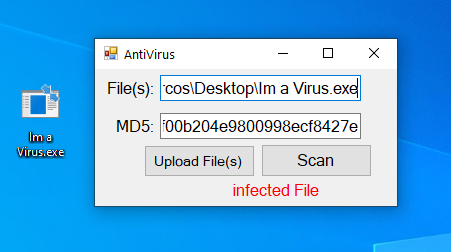
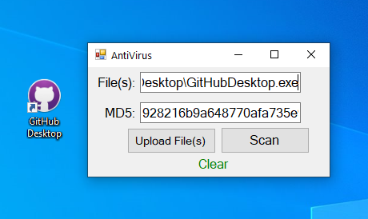

# Anti-Virus-Application

<i>Technologies:</i> C#, Vsual Studdios, .NET Framework, MD5 an Cryptolibrary

Right now, just a basic antivirus to test detection of corrupted or malicious individual files

